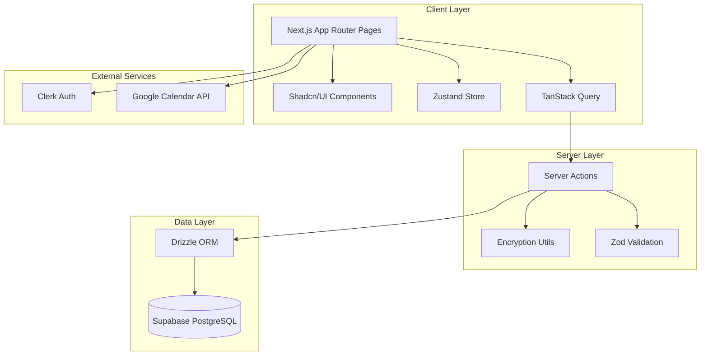

# Design Document: iSubrek - Subscription Tracker

## Overview

iSubrek is a subscription tracking web application built with Next.js 15 (App Router), TypeScript, and a modern stack including Supabase for database, Clerk for authentication, and Shadcn/UI for components. The application enables users to securely manage their subscriptions, track billing cycles, store masked payment methods, and optionally encrypt account passwords.

The system follows a mobile-first design philosophy with responsive layouts, using Sheet/Drawer components for forms on mobile devices. Security is paramount, with payment method masking and AES encryption for sensitive data handled exclusively on the server side.

## Architecture



### Key Architectural Decisions

1. **Server Actions for Data Operations**: All CRUD operations use Next.js Server Actions to ensure sensitive operations (encryption/decryption, database access) happen server-side.

2. **Drizzle ORM with postgres-js**: Direct PostgreSQL connection to Supabase for type-safe database operations with full TypeScript support.

3. **Hybrid State Management**: Zustand for UI state (theme, modals), TanStack Query for server state (subscriptions data with caching and invalidation).

4. **Mobile-First Responsive Design**: Sheet/Drawer for mobile forms, grid layouts for desktop, card-based lists for mobile.

## Components and Interfaces

### Page Components

```typescript
// src/app/page.tsx - Dashboard
interface DashboardProps {
  // Server component - fetches data directly
}

// src/app/subscriptions/[id]/page.tsx - Detail View
interface SubscriptionDetailProps {
  params: { id: string }
}
```

### UI Components

```typescript
// Summary Cards Component
interface SummaryCardsProps {
  totalMonthlySpending: number;
  activeCount: number;
  trialsEndingSoon: Subscription[];
  currency: string;
}

// Subscription Card Component
interface SubscriptionCardProps {
  subscription: Subscription;
  onEdit: (id: string) => void;
  onDelete: (id: string) => void;
  isHighlighted: boolean; // Within reminder days
}

// Subscription Form Component
interface SubscriptionFormProps {
  subscription?: Subscription; // undefined for create, defined for edit
  onSuccess: () => void;
  onCancel: () => void;
}

// Password Copy Button Component
interface PasswordCopyButtonProps {
  subscriptionId: string;
  hasPassword: boolean;
}
```

### Server Actions

```typescript
// Subscription CRUD Actions
async function createSubscription(data: CreateSubscriptionInput): Promise<ActionResult<Subscription>>
async function updateSubscription(id: string, data: UpdateSubscriptionInput): Promise<ActionResult<Subscription>>
async function deleteSubscription(id: string): Promise<ActionResult<void>>
async function getSubscriptions(): Promise<Subscription[]>
async function getSubscriptionById(id: string): Promise<Subscription | null>

// Security Actions
async function decryptPassword(subscriptionId: string): Promise<ActionResult<string>>
```

### Utility Functions

```typescript
// Payment Method Masking
function maskPaymentMethod(fullNumber: string): string
function extractLastFourDigits(fullNumber: string): string

// Password Encryption
function encryptPassword(plainText: string): string
function decryptPassword(cipherText: string): string

// Date Calculations
function calculateNextPaymentDate(startDate: Date, billingCycle: BillingCycle): Date
function isWithinReminderDays(nextPaymentDate: Date, reminderDays: number): boolean

// Calendar Integration
function generateGoogleCalendarUrl(subscription: Subscription): string

// Serialization
function serializeSubscription(subscription: Subscription): string
function deserializeSubscription(json: string): Subscription
```

## Data Models

### Database Schema (Drizzle)

```typescript
import { pgTable, uuid, text, numeric, date, integer, pgEnum } from 'drizzle-orm/pg-core';

export const billingCycleEnum = pgEnum('billing_cycle', ['monthly', 'yearly', 'one-time', 'trial']);
export const statusEnum = pgEnum('status', ['active', 'cancelled', 'expired']);
export const categoryEnum = pgEnum('category', ['Entertainment', 'Tools', 'Work', 'Utilities']);

export const subscriptions = pgTable('subscriptions', {
  id: uuid('id').primaryKey().defaultRandom(),
  userId: text('user_id').notNull(), // Clerk user ID
  name: text('name').notNull(),
  price: numeric('price', { precision: 10, scale: 2 }).notNull(),
  currency: text('currency').notNull().default('IDR'),
  billingCycle: billingCycleEnum('billing_cycle').notNull(),
  startDate: date('start_date').notNull(),
  nextPaymentDate: date('next_payment_date').notNull(),
  reminderDays: integer('reminder_days').notNull().default(3),
  paymentMethodProvider: text('payment_method_provider'),
  paymentMethodNumber: text('payment_method_number'), // Masked: "**** 1234"
  accountEmail: text('account_email'),
  accountPasswordEncrypted: text('account_password_encrypted'),
  notes: text('notes'),
  category: categoryEnum('category'),
  status: statusEnum('status').notNull().default('active'),
});
```

### TypeScript Types

```typescript
// Billing Cycle Type
type BillingCycle = 'monthly' | 'yearly' | 'one-time' | 'trial';

// Status Type
type Status = 'active' | 'cancelled' | 'expired';

// Category Type
type Category = 'Entertainment' | 'Tools' | 'Work' | 'Utilities';

// Subscription Entity
interface Subscription {
  id: string;
  userId: string;
  name: string;
  price: number;
  currency: string;
  billingCycle: BillingCycle;
  startDate: Date;
  nextPaymentDate: Date;
  reminderDays: number;
  paymentMethodProvider: string | null;
  paymentMethodNumber: string | null; // Always masked
  accountEmail: string | null;
  accountPasswordEncrypted: string | null;
  notes: string | null;
  category: Category | null;
  status: Status;
}

// Form Input Types
interface CreateSubscriptionInput {
  name: string;
  price: number;
  currency: string;
  billingCycle: BillingCycle;
  startDate: Date;
  reminderDays: number;
  paymentMethodProvider?: string;
  paymentMethodNumber?: string; // Full number - will be masked
  accountEmail?: string;
  accountPassword?: string; // Plain text - will be encrypted
  notes?: string;
  category?: Category;
}

interface UpdateSubscriptionInput extends Partial<CreateSubscriptionInput> {
  status?: Status;
}

// Action Result Type
interface ActionResult<T> {
  success: boolean;
  data?: T;
  error?: string;
}
```

### Zod Validation Schemas

```typescript
import { z } from 'zod';

export const createSubscriptionSchema = z.object({
  name: z.string().min(1, 'Name is required').max(100),
  price: z.number().positive('Price must be positive'),
  currency: z.enum(['IDR', 'USD']),
  billingCycle: z.enum(['monthly', 'yearly', 'one-time', 'trial']),
  startDate: z.date(),
  reminderDays: z.number().int().min(0).max(30).default(3),
  paymentMethodProvider: z.string().optional(),
  paymentMethodNumber: z.string().optional(),
  accountEmail: z.string().email().optional().or(z.literal('')),
  accountPassword: z.string().optional(),
  notes: z.string().max(500).optional(),
  category: z.enum(['Entertainment', 'Tools', 'Work', 'Utilities']).optional(),
});

export const updateSubscriptionSchema = createSubscriptionSchema.partial().extend({
  status: z.enum(['active', 'cancelled', 'expired']).optional(),
});
```


## Correctness Properties

*A property is a characteristic or behavior that should hold true across all valid executions of a system-essentially, a formal statement about what the system should do. Properties serve as the bridge between human-readable specifications and machine-verifiable correctness guarantees.*

### Property 1: User Data Isolation

*For any* authenticated user ID and any set of subscriptions in the database, querying subscriptions SHALL return only those records where the userId field matches the authenticated user's Clerk ID.

**Validates: Requirements 1.5, 2.5**

### Property 2: Subscription Creation Integrity

*For any* valid subscription input data and authenticated user, creating a subscription SHALL produce a record with a valid UUID (v4 format) and the correct user ID association.

**Validates: Requirements 2.1**

### Property 3: Next Payment Date Calculation

*For any* start date and billing cycle combination:
- Monthly cycle: next payment date SHALL be exactly one month after start date
- Yearly cycle: next payment date SHALL be exactly one year after start date
- One-time cycle: next payment date SHALL equal the start date
- Trial cycle: next payment date SHALL equal the start date (trial end)

**Validates: Requirements 2.2, 2.3, 10.1, 10.2, 10.3, 10.4**

### Property 4: Subscription Deletion Completeness

*For any* existing subscription, after deletion, querying for that subscription by ID SHALL return null/not found.

**Validates: Requirements 2.4**

### Property 5: Zod Validation Correctness

*For any* subscription input data, Zod schema validation SHALL accept all inputs conforming to the schema constraints and reject all inputs violating any constraint, returning appropriate error messages.

**Validates: Requirements 2.6**

### Property 6: Subscription Serialization Round-Trip

*For any* valid Subscription object, serializing to JSON and then deserializing SHALL produce an object equivalent to the original.

**Validates: Requirements 2.7, 2.8**

### Property 7: Payment Method Masking

*For any* payment method number string of 4 or more digits, the masking function SHALL extract only the last 4 digits and return a string in the format "**** XXXX" where XXXX are the last 4 digits.

**Validates: Requirements 3.1, 3.3**

### Property 8: Password Encryption Round-Trip

*For any* plain text password string, encrypting and then decrypting SHALL return the original password string.

**Validates: Requirements 4.1, 4.2**

### Property 9: Total Monthly Spending Calculation

*For any* set of active subscriptions, the total monthly spending calculation SHALL equal the sum of: monthly prices as-is, yearly prices divided by 12, and one-time/trial prices as-is.

**Validates: Requirements 5.1**

### Property 10: Active Subscription Count

*For any* set of subscriptions, the active count SHALL equal the number of subscriptions where status equals 'active'.

**Validates: Requirements 5.2**

### Property 11: Trials Ending Soon Filter

*For any* set of subscriptions and a threshold number of days, the trials ending soon filter SHALL return only subscriptions where billingCycle is 'trial' AND nextPaymentDate is within the threshold days from current date.

**Validates: Requirements 5.3**

### Property 12: Reminder Days Highlighting

*For any* subscription and current date, the isWithinReminderDays function SHALL return true if and only if the difference between nextPaymentDate and current date is less than or equal to reminderDays.

**Validates: Requirements 5.6**

### Property 13: Google Calendar URL Generation

*For any* subscription, the generated Google Calendar URL SHALL contain:
- Event title in format "Renew [subscription name]"
- Date parameter matching the subscription's nextPaymentDate
- Description containing subscription details

**Validates: Requirements 7.1, 7.2, 7.3**

### Property 14: Category and Status Filtering

*For any* set of subscriptions and filter criteria (category or status), filtering SHALL return only subscriptions where the specified field matches the filter value exactly.

**Validates: Requirements 9.2, 9.3**

### Property 15: Payment Date Advancement

*For any* subscription where the current date exceeds the nextPaymentDate, recalculating SHALL advance the nextPaymentDate to the next cycle date (current nextPaymentDate + 1 cycle period) for monthly/yearly cycles.

**Validates: Requirements 10.5**

## Error Handling

### Client-Side Errors

| Error Type | Handling Strategy |
|------------|-------------------|
| Form Validation | Display inline errors via React Hook Form, prevent submission |
| Network Errors | Show toast notification with retry option |
| Authentication Errors | Redirect to Clerk sign-in page |

### Server-Side Errors

| Error Type | Handling Strategy |
|------------|-------------------|
| Database Connection | Return ActionResult with error, log to console |
| Encryption Failure | Return ActionResult with generic error, log details server-side |
| Invalid User ID | Return empty results, do not expose error details |
| Zod Validation | Return ActionResult with validation errors array |

### Error Response Format

```typescript
interface ActionResult<T> {
  success: boolean;
  data?: T;
  error?: string;
  validationErrors?: Record<string, string[]>;
}
```

## Testing Strategy

### Property-Based Testing Library

**Library:** fast-check (TypeScript/JavaScript)

fast-check is chosen for its excellent TypeScript support, comprehensive arbitrary generators, and seamless integration with Jest/Vitest testing frameworks.

### Unit Testing Approach

Unit tests will cover:
- Specific edge cases (empty inputs, boundary values)
- Integration points between components
- Error condition handling
- UI component rendering

### Property-Based Testing Approach

Each correctness property from the design document will be implemented as a property-based test using fast-check. Tests will:
- Run a minimum of 100 iterations per property
- Use smart generators that constrain inputs to valid domain values
- Be tagged with comments referencing the design document property

**Test Annotation Format:**
```typescript
// **Feature: isubrek-subscription-tracker, Property {number}: {property_text}**
```

### Test File Structure

```
src/
├── lib/
│   ├── __tests__/
│   │   ├── encryption.test.ts      # Property 8
│   │   ├── masking.test.ts         # Property 7
│   │   ├── date-calc.test.ts       # Properties 3, 12, 15
│   │   ├── calculations.test.ts    # Properties 9, 10, 11
│   │   ├── filtering.test.ts       # Properties 1, 14
│   │   ├── serialization.test.ts   # Property 6
│   │   └── calendar.test.ts        # Property 13
│   └── ...
├── actions/
│   └── __tests__/
│       └── subscriptions.test.ts   # Properties 2, 4, 5
└── ...
```

### Testing Tools

- **Test Runner:** Vitest (fast, ESM-native, excellent TypeScript support)
- **Property Testing:** fast-check
- **Assertions:** Vitest built-in assertions
- **Mocking:** Vitest mocking (minimal use - prefer real implementations)
